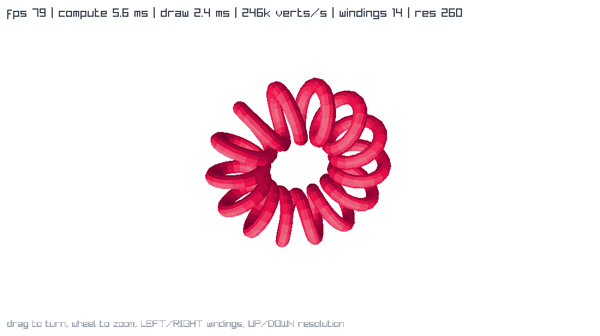
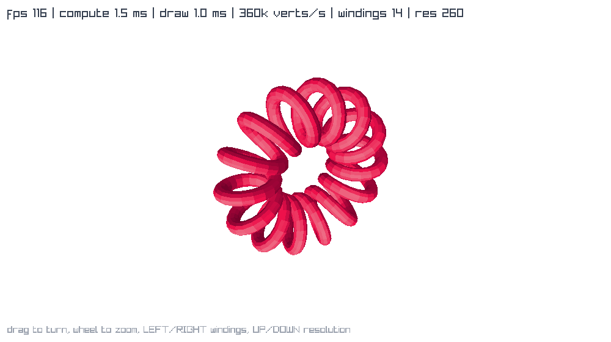
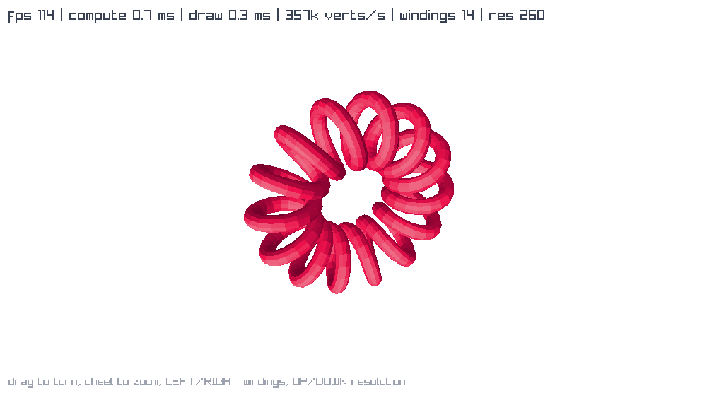

# lisp-games

Small graphical programs, each written once per Clojure-family runtime and kept
side by side so the differences are readable. Every directory is a standalone
project you can copy out on its own and run with `bb`, and nothing is shared
between them on purpose.

**None of these games are ours.** Each one is a port of somebody else's work,
and every port lands with its credit in the same commit. Who wrote what is in
[NOTICE.md](NOTICE.md), and each game directory repeats it.

## Games

| Game | Original | Ports |
|---|---|---|
| [`helitorus/`](helitorus) | [Michiel Borkent](https://github.com/borkdude), [babashka/ffi](https://github.com/babashka/ffi/blob/main/examples/helitorus.clj) | babashka, jolt, Clojure, jank |

| | |
|---|---|
| **babashka** <br>  | **jolt** <br>  |
| **Clojure/JVM** <br>  | **jank** <br>  |

## Layout

One directory per game, then one per runtime inside it:

```
<game>/
  README.md              what the game is, where it came from, who wrote it
  <game>-babashka/       bb.edn, src/
  <game>-clojure/
  <game>-jank/
  <game>-jolt/
```

A runtime directory carries its own build file and its own `bb.edn` with the
same `info` / `shot` / `check` / `doctor` tasks, so every port answers the same
commands whatever it is written in.

## Running one

```sh
cd helitorus/helitorus-babashka && bb helitorus
```

Every port also takes optional arguments, which is what makes it runnable with
nobody at the keyboard:

```sh
bb helitorus 10                  # quit after ten seconds of frame time
bb helitorus 3 out.png 40        # quit after three, capture frame 40
bb helitorus 3 out.png 40 400    # the same, starting at resolution 400
```

`bb check` loads a port without opening a window and `bb doctor` says which
toolchain is missing.

## Prerequisites

Every port links against a system raylib 6.0 or newer, which none of them
bundle:

```sh
brew install raylib                # macOS
sudo pacman -S raylib              # Arch, and your distro's equivalent
```

Then per runtime: babashka needs `bb` 1.13.220, because these use the
`babashka.ffi` built into bb. That namespace is present in 1.13.220 and absent
in 1.12.212, both checked here, so anything between the two is untested. The Clojure ports need a JDK 22 or newer,
because coffi sits on Panama. jank needs `jank` and a Leiningen, and jolt needs
`jolt`.

## Why more than one runtime

These are the same program four ways, so what changes is only how each runtime
reaches C and what that costs. helitorus is the interesting case, because it
rebuilds and projects the whole surface in Clojure every frame. The HUD reports
compute and draw milliseconds separately, so the comparison is a measurement
rather than a guess. On an M1 Pro:

| Resolution | | compute | draw | fps |
|---|---|---|---|---|
| 260 (default) | Clojure | 0.7 ms | 0.3 ms | 115 |
| | jank | 1.2 ms | 0.8 ms | 115 |
| | jolt | 1.5 ms | 1.0 ms | 115 |
| | babashka | 5.1 ms | 2.3 ms | 115 |
| 900 (max) | Clojure | 2.4 ms | 1.0 ms | 116 |
| | jank | 4.3 ms | 2.8 ms | ~108 |
| | jolt | 5.0 ms | 3.3 ms | ~95 |
| | babashka | 18.0 ms | 8.3 ms | ~35 |

At the default resolution all four hold exactly the same frame rate, because
none of them is the bottleneck there. Push to 900 rings and they separate. The
longer version, including the two measurements that were badly wrong until a
suspicious ordering gave them away, is in
[helitorus/README.md](helitorus/README.md).

A sibling repo, [raylib-pacman](https://github.com/b12n-oss/raylib-pacman),
does the same for Pac-Man across four runtimes and has the longer write-up of
what each FFI will and will not carry.

## Adding a game

A new game is a new `<game>/` directory with at least one runtime inside it, a
`README.md` naming the original and its author, an entry in the Games table
above, and a section in [NOTICE.md](NOTICE.md) reproducing whatever licence the
original came under. The credit is not a follow-up task. It goes in the commit
that adds the code.

## Licence

Eclipse Public License 2.0, in [LICENSE](LICENSE). The games ported here came
from work under other licences, and those notices are kept in
[NOTICE.md](NOTICE.md).
