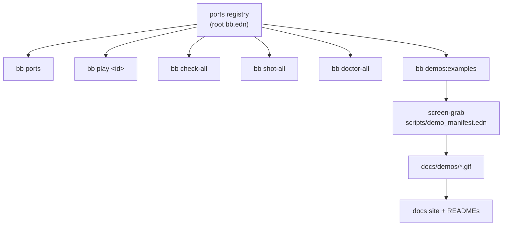

# Architecture

Two games, four runtimes, eight standalone projects and nothing shared
between any of them. This page is about why it is built that way, and what
each layer is for.

## Eight projects, deliberately duplicated

```
lisp-games/
  <game>/
    README.md                 what the game is, where it came from, who wrote it
    <game>-babashka/          bb.edn, src/
    <game>-clojure/           deps.edn, bb.edn, src/
    <game>-jank/              project.clj, bb.edn, src/
    <game>-jolt/              deps.edn, bb.edn, src/
```

Each runtime directory is a standalone project with its own build file. You
can copy one out on its own and it will run. Nothing is shared: no common
library of game logic, no per-runtime backends behind one interface, not even
a shared constants file.

That is the point rather than an oversight. The repo exists so the four
versions can be read side by side, and an abstraction that hid the
differences would destroy the only thing it has to say. The duplication is
the artefact.

The cost is real. A change to a game is four changes, and the four can drift.
What keeps that honest is that every port renders the same picture and reports
its own numbers, so drift shows up as a divergent frame or a divergent
measurement rather than as silence.

## One registry, and everything walks it

The exception to "nothing is shared" is the `ports` vector at the top of the
root `bb.edn`. It is the only place a port is listed.



Adding a runtime means a directory plus an entry there, and nothing else in
that file changes. The demo recorder reads the same registry through
`bb demos:examples` rather than keeping its own list, because a second list
drifts from the first.

## The same shape in every port

Whatever the language, each port answers the same commands:

| | |
|---|---|
| `bb info` | every task here, grouped |
| `bb check` | load or compile, no window |
| `bb shot` | run a few seconds, write a PNG |
| `bb doctor` | is the toolchain present |

and takes the same run arguments: `[seconds] [out.png] [frame]`, plus a
per-game extra. That uniformity is what makes the sweeps and the recorder
possible at all.

The `seconds` deadline counts **game time**, summed from the clamped
per-frame dt, rather than wall time. A runtime that pays a one-off cost
before the first frame would otherwise spend its whole budget there and quit
looking like a program that does not work, which is exactly what `lein run`
does to the jank ports.

## What each layer is allowed to differ in

The games are ports, so the maths is fixed. What varies is everything below
it:

- **how the runtime reaches C.** Four different FFIs, covered in
  [runtimes.md](runtimes.md).
- **how buffers are typed.** Four different answers, and three of them fail
  silently when wrong.
- **how a struct crosses.** From "the compiler already knows" on jank to a
  hand-written layout on babashka.

Everything above the drawing layer is ordinary Clojure and reads nearly the
same in all four.

## The docs site

`docs/guide/*.md` is the content; the generator is
[jlt-commons/docs-engine](https://github.com/jlt-commons/docs-engine), a
separate repo rather than a dependency. `bb site:build` finds a checkout,
`bb site:serve` previews it, and the build output is gitignored.

The previews under `docs/demos/` are committed, which is what keeps the docs
buildable by anyone: they were recorded with internal tools that are not
public, and nothing in this repo needs those tools to build or read.
