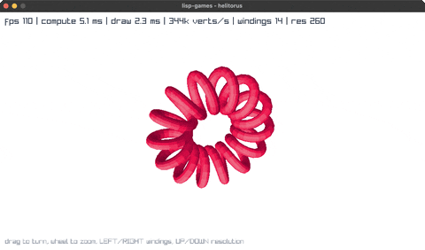
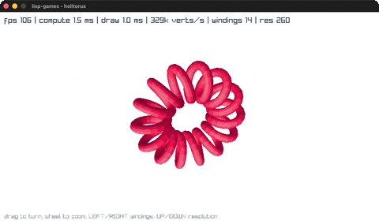
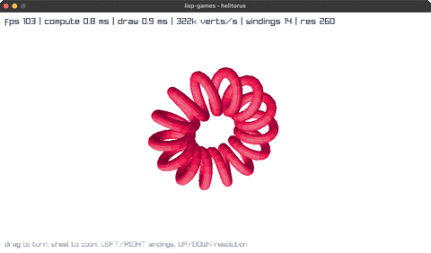
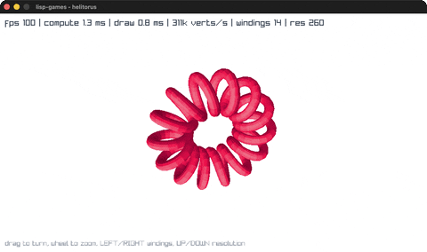

# helitorus

A helix of n windings around a torus, swept into a tube, turned by the mouse.

| | |
|---|---|
| **babashka** <br>  | **jolt** <br>  |
| **Clojure/JVM** <br>  | **jank** <br>  |

The program is **Michiel Borkent**'s. See [credit.md](credit.md).

## What it does per frame

The surface is generated rather than modelled. Walk the spine of a helix that
itself follows a torus, build a local frame at each point, sweep a circle
around that frame, and the result is a tube. Projection, lighting and
hidden-surface removal all happen in Clojure rather than in raylib, which is
what makes it worth porting: it shows what the rlgl layer alone can carry.

At the default resolution that is 260 rings of 12 points, so 3120 vertices
rebuilt, projected, shaded and depth-sorted from scratch, sixty or more times a
second.

Two things make that fast enough to animate. The buffers are reused every
frame, so a frame allocates nothing. And the painter ordering runs over an
`order` array that **survives the frame**, so consecutive frames start almost
sorted and the insertion sort is nearly linear.

## What it costs

On an M1 Pro, every port optimised.

| Resolution | | compute | draw | fps |
|---|---|---|---|---|
| 260 (default) | Clojure | 0.7 ms | 0.3 ms | 115 |
| | jank | 1.2 ms | 0.8 ms | 115 |
| | jolt | 1.5 ms | 1.0 ms | 115 |
| | babashka | 5.1 ms | 2.3 ms | 115 |
| 900 (max) | Clojure | 2.4 ms | 1.0 ms | 116 |
| | jank | 4.3 ms | 2.8 ms | ~108 |
| | jolt | 5.0 ms | 3.3 ms | ~95 |
| | babashka | 18.0 ms | 8.3 ms | ~35 |

A JIT on top, two AOT-compiled runtimes within a whisker of each other, then an
interpreter. About 7x from top to bottom.

The top half is the interesting half. At 260 rings **all four sit at exactly
the same frame rate**, because none of them is the bottleneck there. It takes
900 rings before the gap becomes something a viewer would see, and even there
babashka is still drawing a moving picture. That is further than an interpreter
usually gets credit for.

## The trap every port meets

Each runtime has its own spelling of the same problem, and getting it wrong is
silent in three of the four cases.

**babashka** wants `aset-double` and `aset-int` rather than plain `aset`, which
on bb goes through `java.lang.reflect.Array` at about 6.7µs a write against
roughly 37ns typed. That comment is in the original and it earns its place.

**jolt** wants `^double/1` and `^int/1` on the buffers.

**Clojure on the JVM** wants `^"[D"` and `^"[I"` on the defs. Without them
every `aget` resolves reflectively, which cost thirty times on compute. Note
the hint has to be the array class: `^doubles` on a `def` resolves to
`clojure.core/doubles`, the function, and the namespace will not compile.

**jank** has no primitive arrays at all. `double-array`, `int-array` and `aget`
all exist in `clojure.core.jank` and all throw `TODO: port ...`, still true
against upstream at 2026-09-20. So its buffers are `malloc`'d natives, cast to
`(:* double)` or `(:* int)`, carried as `cpp/box` values because a native
pointer cannot be a jank fn's parameter.

None of these is caught by a plain load gate. See
[reading-the-numbers.md](reading-the-numbers.md).

## Running it

```sh
cd helitorus/helitorus-babashka && bb helitorus
```

Drag to turn, wheel to zoom, LEFT and RIGHT change the winding count, UP and
DOWN the resolution along the spine. For jank, build and run the `-O3` binary
rather than `lein run`:

```sh
cd helitorus/helitorus-jank && bb release && bb run-release
```
