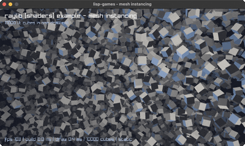
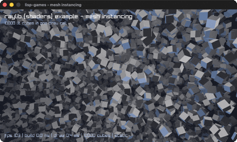
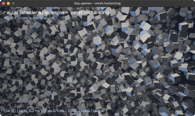
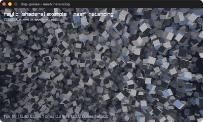

# mesh-instancing

Ten thousand lit cubes in a single draw call.

| | |
|---|---|
| **babashka** <br>  | **jolt** <br>  |
| **Clojure/JVM** <br>  | **jank** <br>  |

The example is **raylib's own**, by Ramon Santamaria and contributors. See
[credit.md](credit.md).

## What instancing is for

Instancing moves the per-copy transform out of the draw loop and into a vertex
attribute. One mesh and one material go to the GPU alongside an array of N
matrices, and the vertex stage reads its own matrix per instance from
`in mat4 instanceTransform`. The alternative, a `DrawMesh` per cube, is ten
thousand draw calls a frame.

Nothing has to be wired up for that attribute. raylib 6.0 resolves it by name
when the shader loads.

## Two modes, and only one is a benchmark

raylib's example builds its matrices once and turns the field by orbiting the
camera. That is the right shape for showing instancing off and the wrong shape
for comparing runtimes: per frame the CPU does essentially nothing, so all four
report the same frame rate and what you measured is your GPU.

So every port takes a `spin` mode that rebuilds each matrix every frame. Then
the frame is per-instance arithmetic plus marshalling into foreign memory,
which is the runtime's own contribution.

| Mode | Instances | | build | draw | fps |
|---|---|---|---|---|---|
| static | 10000 | all four | 0.0 ms | ~0.4 ms | ~114 |
| spin | 10000 | Clojure | 1.9 ms | 0.4 ms | 110 |
| | | jank | 6.5 ms | 0.3 ms | 115 |
| | | jolt | 27.2 ms | 0.3 ms | 33 |
| | | babashka | 50.5 ms | 0.4 ms | 20 |
| spin | 2000 | Clojure | 0.7 ms | 0.2 ms | 106 |
| | | jank | 1.1 ms | 0.2 ms | 114 |
| | | jolt | 5.5 ms | 0.2 ms | 115 |
| | | babashka | 9.9 ms | 0.3 ms | 87 |

The `draw` column barely moves, whatever the runtime and whatever the count,
because one draw call is one draw call. Everything that changes is `build`.

About 27x from top to bottom, against helitorus's 7x on the same four
runtimes. Same ordering, very different distances: these FFIs are further apart
at moving bytes than the languages are at arithmetic.

## The sterner FFI test

`Mesh` is 120 bytes returned by value from `GenMeshCube`, `Material` is 40 from
`LoadMaterialDefault`, and `DrawMeshInstanced` takes **both by value** plus a
pointer to the matrix array. Every layout size in the babashka port was checked
against a C program compiled with the same header rather than counted by eye.

How each runtime handles that is the comparison:

- **jank** has the least to do. Mesh and Material cross with no ceremony at
  all, because it has the real header and the C++ compiler knows the types.
- **babashka** declares them as `[:struct ...]` layouts. This works, and a
  fortnight ago the docs in the sibling repo claimed `babashka.ffi` could not
  do it.
- **jolt** has them through the raylib-jlt wrapper.
- **Clojure** declares seven calls itself with coffi's `defcfn`, plus its own
  `::shader` and `::material` aliases, because raylib-clj's split the Shader
  pointer into two ints and flatten the nesting.

## Two ways to draw one cube instead of ten thousand

Both happened here, and neither showed up in the numbers.

The first spike had no instancing shader, so the default material ignored the
transforms entirely. The Clojure port assoc'd `:shader` onto raylib-clj's
`::material`, which flattens the nested Shader, so the key was silently
ignored and the default shader stayed. It ran at 114 fps reporting plausible
timings the whole time.

**Pick one representation of a struct and use it end to end.** Mixing
raylib-clj's shader functions with nested aliases throws
`Cannot invoke java.lang.Character.charValue()`, which names nothing useful.

And look at the render.

## jank's two matrix paths

The jank port ships `spin` and `spin-raymath`: the rotation computed in jank,
or by raylib's C helpers. About 3x apart, both verified in C to produce an
identical matrix.

```sh
cd mesh-instancing/mesh-instancing-jank && bb ab
```

The cross-runtime table above quotes the in-language path, because the other
three compute the rotation themselves. For ordinary jank code, raymath is the
better choice and costs no new dependency.

## Running it

```sh
cd mesh-instancing/mesh-instancing-babashka && bb mesh
bb bench 10000     # spin mode, the number worth comparing
```
