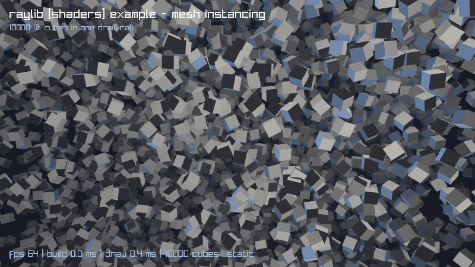

# mesh-instancing

Ten thousand lit cubes in a single draw call.

## Credit

The example is **raylib's own**,
[`examples/shaders/shaders_mesh_instancing.c`](https://github.com/raysan5/raylib/blob/master/examples/shaders/shaders_mesh_instancing.c),
by **Ramon Santamaria** ([@raysan5](https://github.com/raysan5)) and
contributors, zlib licensed. Unlike helitorus this is not a port of anybody's
port: the lineage stops at raylib.

The lighting and fog shaders follow the jolt port in
[jlt-commons/raylib-jlt](https://github.com/jlt-commons/raylib-jlt), itself a
port of the same C example. zlib asks that altered versions be plainly marked,
which is what the header of each source file is for. Notices in full are in
[NOTICE.md](../NOTICE.md).

## Ports

| Runtime | Directory | Binding | Status |
|---|---|---|---|
| babashka | [`mesh-instancing-babashka/`](mesh-instancing-babashka) | `babashka.ffi` | runs |
| jolt | [`mesh-instancing-jolt/`](mesh-instancing-jolt) | `net.b12n/raylib`, `jolt.ffi` | runs |
| Clojure on the JVM | `mesh-instancing-clojure/` | raylib-clj, coffi over Panama | not written yet |
| jank | `mesh-instancing-jank/` | `cpp/` interop | not written yet |

## Two modes, and only one of them is a benchmark

This is the part worth understanding before reading any number from it.

raylib's example builds its matrices once and turns the field by orbiting the
camera. That is the right shape for showing instancing off, because the whole
point is that ten thousand cubes cost one draw call. It is the wrong shape for
comparing runtimes: per frame the CPU does essentially nothing, so every
runtime reports the same frame rate and what you measured was your GPU.

So each port takes a `spin` mode that rebuilds every matrix every frame. Then
the frame is per-instance arithmetic plus marshalling into foreign memory,
which is the runtime's own contribution.

Read the `draw` column first in any table below. It barely moves between modes
or instance counts, because one draw call is one draw call. Everything that
changes is `build`.

**Always say which mode and how many instances a number came from.** A `static`
fps and a `spin` fps are not the same measurement.

## What it costs

On an M1 Pro. Two ports so far.

| Mode | Instances | | build | draw | fps |
|---|---|---|---|---|---|
| static | 10000 | jolt | 0.0 ms | 0.5 ms | 113 |
| | 10000 | babashka | 0.0 ms | 0.4 ms | 115 |
| spin | 10000 | jolt | 27.2 ms | 0.3 ms | 33 |
| | 10000 | babashka | 50.5 ms | 0.4 ms | 20 |
| spin | 2000 | jolt | 5.5 ms | 0.2 ms | 115 |
| | 2000 | babashka | 9.9 ms | 0.3 ms | 87 |

## Why this one is a good second game

[helitorus](../helitorus) puts all its work in one place: arithmetic over
primitive buffers, then a vertex at a time through rlgl. It separates the
runtimes cleanly and says nothing about anything else.

This one splits the work in two. The arithmetic is the same kind of thing, but
the result has to cross into C as one large block of foreign memory, and the
draw itself is a single call carrying two structs by value. So it exercises the
FFI's *marshalling* rather than its call overhead, and the static mode proves
that the call overhead was never the interesting part.

It is also the sterner test of an FFI. `Mesh` is 120 bytes by value, `Material`
40, and both cross in one call. Two of the four runtimes here would have been
described a fortnight ago as unable to do that.
